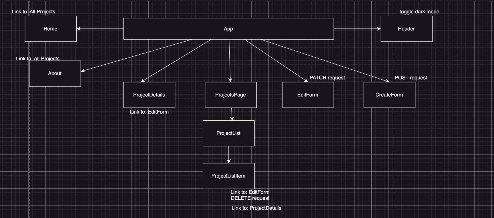

# Phase 2 Lecture Project Pitch Example

### This application showcases a few of the awesome projects built by students at the Flatiron School's Software Engineering bootcamp.

[Github](https://github.com/rachelAtFlatiron/EAST-SE-041023-Phase-2-React/tree/my-portfolio-demo)

---

## [Wireframes](https://www.figma.com/file/EiEpomnCYh7AGbhqc2p3pk/Phase-2-Portfolio-Demo?type=design&node-id=0%3A1&t=YvzclA1k0MT8cjhW-1)


---


## User Stories
- User will be able to...
1. View all projects
2. View single project 
3. Like a project
4. Delete a project
5. Edit a project
6. Create a project
7. View top 5 most liked projects
8. View projects by phase
9. Toggle between dark and light mode

---

## React Tree



---

## [API Routes](https://documenter.getpostman.com/view/26331028/2s93Y3uLLX)
- [table markdown generating tool](https://www.tablesgenerator.com/markdown_tables)

| API Route     | Request Method | Body                                     | Response                                     |
|---------------|----------------|------------------------------------------|----------------------------------------------|
| /projects     | GET            |                                          | [{...}, {...}, ...]                          |
| /projects     | POST           | {name, about, phase, link, image, claps} | {id, name, about, phase, link, image, claps} |
| /projects/:id | DELETE         |                                          | {}                                           |
| /projects/:id | PATCH          | {name, ...}                              | {id, name, about, phase, link, image, claps} |
|/projects?_sort=claps&_order=desc&_limit=5|GET | | [top five projects] |

---

## Example JSON

```js
[
    {
        "name": "Netflix",
        "about": "Netflix is a streaming service that offers a wide variety of award-winning TV shows, movies, anime, documentaries, and more.",
        "image": "https://miro.medium.com/v2/resize:fit:1400/1*8BtlgpxyjOPaLZXO6pVD0Q.jpeg",
        "claps": 28,
        "link": "https://www.netflix.com/",
        "phase": 5,
        "id": 32
    },
    {
        "name": "Nike",
        "about": "The world's largest athletic apparel company, Nike is best known for its footwear, apparel, and equipment.",
        "image": "https://assets.fontsinuse.com/static/use-media-items/44/43115/full-1190x905/57c69580/Nike02.jpeg",
        "claps": 27,
        "link": "https://www.nike.com/",
        "phase": 0,
        "id": 30
    },
]
```

---

## Client Side Routes
| Client Route       | Component             |
|--------------------|-----------------------|
| /                  | Home.js             |
| /projects          | ProjectsPage.js     |
| /new               | CreateProjectForm.js|
| /about             | About.js            |
| /home              | Home.js             |
| /projects/:id      | ProjectDetails.js   |
| /projects/:id/edit | EditProjectForm.js  |

---

## Trello

